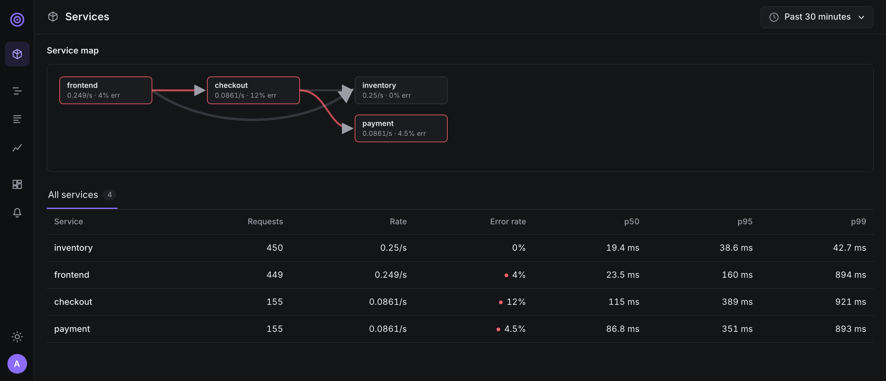
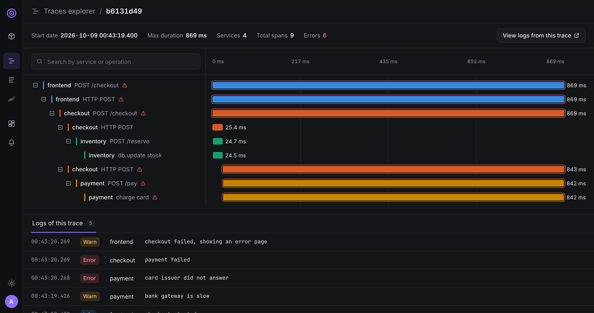
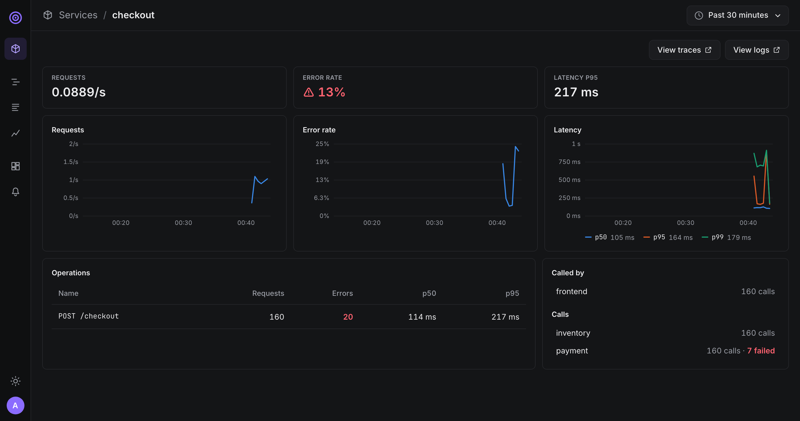
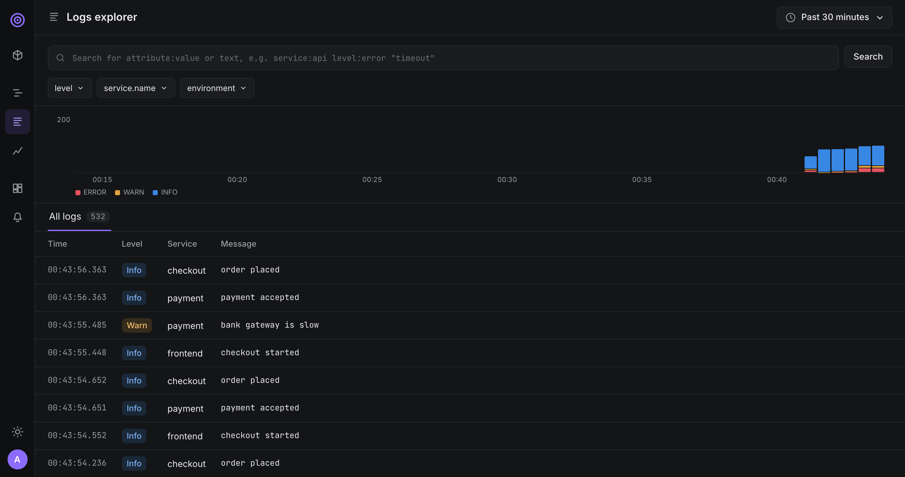
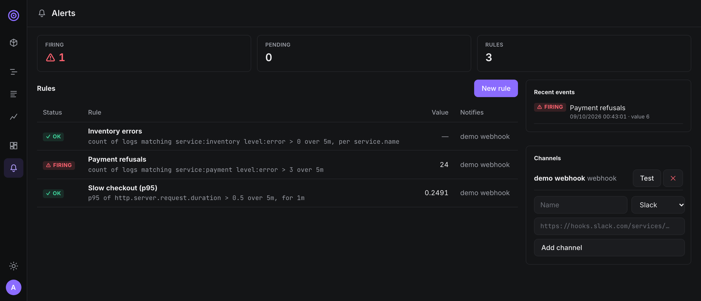
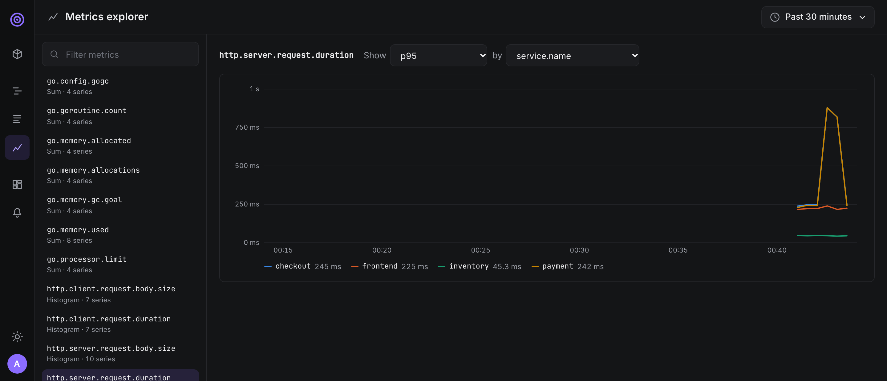
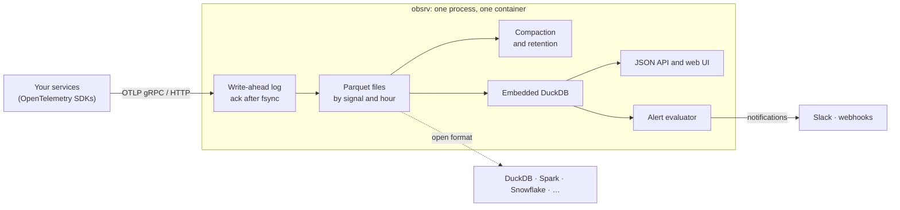

<p align="center">
  <picture>
    <source media="(prefers-color-scheme: dark)" srcset="docs/images/logo-dark.svg">
    
  </picture>
</p>

<p align="center">
  <strong>Logs, metrics and traces in a single container.</strong><br>
  OpenTelemetry-native. Your data stays yours, in open formats.
</p>

<p align="center">
  <a href="https://github.com/mtk14n/obsrv/actions/workflows/ci.yml"></a>
  <a href="LICENSE"></a>
  
  
</p>

<p align="center">
  <a href="#try-the-demo">Try the demo</a> ·
  <a href="#a-quick-tour">Tour</a> ·
  <a href="#how-it-works">How it works</a> ·
  <a href="docs/ROADMAP.md">Roadmap</a> ·
  <a href="CONTRIBUTING.md">Contributing</a>
</p>

<picture>
  <source media="(prefers-color-scheme: light)" srcset="docs/images/services-light.png">
  
</picture>

> [!WARNING]
> obsrv is in early development and is not ready for production. The API, the storage format and
> the configuration may change without notice until v1.0.

## Why obsrv

- **All-in-one.** Ingestion, storage, queries and the web UI ship as one binary in one container.
  You don't need Postgres, ClickHouse, Kafka or Grafana.
- **OpenTelemetry-native.** OTLP is the only way in. Use the official OpenTelemetry SDKs and
  Collector, never a proprietary agent.
- **Simple to query.** Use a visual metrics explorer and a short log search syntax
  (`service:api level:error "timeout"`). You don't need PromQL or a query language to learn.
- **Correlated.** Go from a service to its slow requests, from a trace to its logs, from an error to
  the call that caused it, in a click.
- **Alerting included.** Alert on log counts or metrics, and get notified on Slack or any webhook.
- **No lock-in.** Telemetry is stored as Apache Parquet with a [public schema](pkg/schema/schema.go),
  on your disk or in your own S3 bucket. Any tool can read it, even when obsrv is not running, and a
  test in CI guarantees it.

## A quick tour

### Follow a request across services

The waterfall shows where the time went and where it failed. The logs of the trace are listed under it.



### See every service at a glance

Each service has its own page: request rate, error rate and latency over time, its operations, and
the services it calls or is called by.



### Search logs

Search with a short syntax, see the volume by severity, and open any line to see its attributes and its trace.



### Get alerted

Alert on a log count or a metric, per service if you want, and get notified on Slack or any
webhook. A preview shows the current value before you save a rule.



### Explore metrics without a query language

Pick a metric, an aggregation and a grouping. Counters become rates and histograms give percentiles.



## Try the demo

You need Docker. This starts obsrv and a small shop made of four services (frontend, checkout,
inventory, payment) instrumented with the official OpenTelemetry SDK. The payment service is slow
from time to time and sometimes refuses cards, so there is something to investigate.

```sh
make demo        # or: docker compose -f deploy/demo/docker-compose.yml up --build -d
```

Open <http://localhost:8080> and sign in with **`admin@obsrv.local`** / **`obsrv-demo-password`**.
Data appears within seconds. Things to try:

1. **Services**: checkout has about 10% errors. Click it.
2. **Traces**: tick *Errors only* and open a trace. The payment call failed, and its logs are under the waterfall.
3. **Logs**: search `level:error`, or `service:payment "refused"`. Click a line, then *View trace*.
4. **Metrics**: pick `http.server.request.duration` and show the `p95` by `service.name`.
5. **Alerts**: the demo comes with three rules. *Payment refusals* fires within a minute or two.
   Watch the notifications arrive with `docker compose -f deploy/demo/docker-compose.yml logs -f webhook`.
6. **Leave whenever you want**: the data is plain Parquet. You can query it with DuckDB, without obsrv:

   ```sh
   docker compose -f deploy/demo/docker-compose.yml cp obsrv:/data/store ./obsrv-data
   duckdb -c "SELECT service_name, count(*) FROM './obsrv-data/v1/spans/**/*.parquet' GROUP BY 1"
   ```

Stop and delete everything with `make demo-down`.

## Send your own telemetry

Run obsrv from source (`make run`) or with Docker. On first start, open the UI: it asks you to create
the administrator account. Then point any OpenTelemetry SDK or Collector at obsrv:

```sh
OTEL_EXPORTER_OTLP_ENDPOINT=http://localhost:4318   # OTLP/HTTP, or :4317 for OTLP/gRPC
```

### Secure it

- **Sign-in.** The UI and the API require an account. Admins add users from *Settings*. For automated
  deployments, `-admin-email` and `-admin-password` create the first admin on start.
- **Ingest token.** By default anyone who can reach the OTLP ports can send telemetry. Set
  `-ingest-token` and have your SDKs or Collector send it with the standard variable:

  ```sh
  obsrv -ingest-token "$TOKEN"
  OTEL_EXPORTER_OTLP_HEADERS="Authorization=Bearer%20$TOKEN"   # on the client side
  ```
- **HTTPS.** Put obsrv behind a TLS reverse proxy and set `-public-url https://…`: session cookies are
  then sent over HTTPS only.

| Port | Purpose |
|---|---|
| 4317 | OTLP/gRPC |
| 4318 | OTLP/HTTP (protobuf and JSON) |
| 8080 | Web UI and `/api/v1` |

Useful flags: `-data-dir` (default `./data`), `-retention` (default `168h`), `-public-url` (used
for links in alert notifications and for secure cookies) and `-ingest-token`. Every flag can also
be set with an environment variable: `-retention` is `OBSRV_RETENTION`. Run `obsrv -help` for the full list.

## Keep your data in your own bucket

obsrv can store telemetry in any S3-compatible bucket, such as AWS S3, MinIO, Cloudflare R2,
Scaleway or OVHcloud, instead of the local disk. Queries go through a local disk cache.

```sh
AWS_ACCESS_KEY_ID=… AWS_SECRET_ACCESS_KEY=… obsrv \
  -storage s3 -s3-endpoint s3.eu-west-3.amazonaws.com -s3-region eu-west-3 \
  -s3-bucket my-telemetry -s3-prefix obsrv
```

Credentials come from the environment, `~/.aws/credentials` or the machine's IAM role. To try it
locally with MinIO, run `make demo-s3` and open the MinIO console at <http://localhost:9001>
(`minioadmin` / `minioadmin`) to browse the Parquet files.

## How it works



- **Durable.** A batch is acknowledged only once it is written to the write-ahead log. After a crash,
  unflushed data is replayed.
- **Fresh.** Data is queryable as soon as it is acknowledged.
- **Compact.** Rows are sorted and stored as ZSTD-compressed Parquet. Small files are merged once an hour is complete.
- **Fast enough on a laptop.** On one hour of generated telemetry (about 900K items), every query
  answers in under 100 ms. See the [benchmark results](bench/RESULTS.md), including where we miss our targets.

Read more in the [architecture document](docs/ARCHITECTURE.md) and the [decision records](docs/adr/).

## Building from source

Requirements: Go (see `go.mod`) with cgo, meaning a C compiler for the embedded DuckDB, Node.js 22+, and `make`.

```sh
make test      # Go and web tests
make lint      # linters and type checks
make build     # ./bin/obsrv with the embedded UI
make run       # build and run with data in ./data
make bench     # measure ingestion, storage and queries
```

The repository is organised as follows:

| Path | Contents |
|---|---|
| `cmd/obsrv` | The binary |
| `internal/` | Ingestion, WAL, storage, compaction, queries, API |
| `pkg/schema` | The public storage schema |
| `web/` | The web UI (Vue 3, TypeScript) |
| `examples/demo-shop` | The instrumented demo application |
| `bench/` | Benchmark harness and results |
| `docs/` | Architecture, roadmap, design principles, ADRs |

## Contributing

Contributions are welcome. We practice test-driven development and use Conventional Commits with
DCO sign-off. Please read [CONTRIBUTING.md](CONTRIBUTING.md) and the [Code of Conduct](CODE_OF_CONDUCT.md).
To report a vulnerability, follow [SECURITY.md](SECURITY.md) rather than opening a public issue.

## License

obsrv is licensed under the [Apache License 2.0](LICENSE).
